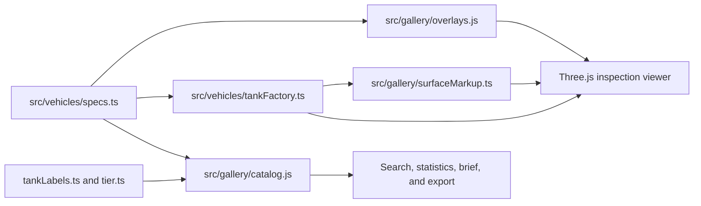

# Tank Gallery

Status: current public feature reference

Route: `/gallery`

Entry: `gallery.html`
Implementation: `src/gallery/`

The Tank Gallery is the public fleet reference for Claude of Tanks. It loads
the same first-party procedural vehicle constructor used by the garage, battle,
Scene Studio, and generated-asset tools, then presents one vehicle in a focused
inspection environment.

The Gallery does not maintain a separate vehicle registry. All labels,
specifications, armor plates, modules, crew volumes, and visual rigs come from
the canonical `src/vehicles/` sources.

## User capabilities

- search by vehicle name, stable ID, alias, nation, role, era, or tier;
- filter by nation and era;
- orbit, zoom, and select hero/front/left/right/rear/top/elevated cameras;
- enable or pause an automatic turntable;
- change hull yaw, turret yaw, and gun elevation within authored limits;
- display exterior, armor, module, crew, or exact-surface markup layers;
- select a diagnostic volume to read its identifier, ownership, dimensions,
  and protection values;
- select a single triangle or connected coplanar patch from live geometry;
- record inspect, remove, reshape, or add-here instructions with articulation
  ownership, rig path, local/world bounds, centroids, normals, and pose;
- focus, undo, clear, copy, or download surface annotations and save a matching
  PNG review image;
- read normalized operational ratings and a generated technical brief for
  every playable vehicle;
- inspect dimensions, mobility, weapon, protection, and ammunition data;
- copy a shareable vehicle/layer URL;
- copy a versioned normalized data record;
- open the shared 88-frame field archive to inspect the same procedural rigs
  in combat, destruction, terrain, HUD, mobile, Gallery, and Studio contexts.

## Architecture



### Catalog

`catalog.js` converts each canonical specification into a read-only gallery
record. It owns:

- search text and filters;
- normalized 0–100 presentation ratings;
- derived metrics such as power-to-weight ratio and damage per minute;
- technical summary paragraphs and highlight bullets;
- the normalized copy-data schema.

Ratings are comparative presentation aids. Canonical raw values remain visible
in the dossier and in copied data.

### Viewer

`gallery.ts` owns the renderer, camera, lighting, environment, roster
interaction, selected vehicle, articulation controls, URL state, and browser
automation contract. It constructs vehicles with:

```js
createTank(id, engineCtx, {
  camoSeed: 4242,
  quality: 'high',
  proceduralOnly: true,
});
```

The viewer constructs a single vehicle at a time. Selecting another vehicle
removes and disposes the previous model before constructing the replacement.

The viewer header also opens the shared presentation archive. Gallery mounts
`src/presentation/mediaArchive.ts` only when the dialog is requested; the
component fetches `public/media/showcase-r1/manifest.json`, lazy-loads its
WebP frames in a horizontally scrollable compact rail, and reuses the same
lightbox/filter semantics as the landing page, field manual, and Studio. This
keeps the public route focused on the selected vehicle until the user opens the
larger archive.

### Diagnostic overlays

`overlays.js` builds transient Three.js geometry from the specification:

| Layer | Canonical source | Presentation |
| --- | --- | --- |
| Exterior | Procedural vehicle rig | Current materials and geometry |
| Armor | `armor.collisionShells` plus layered plates | Exact closed collision faces with canonical protection bands |
| Modules | `armor.modules` + shared kill-cam anatomy builder | Recognizable ammo, engine, fuel, gun, optics, radio and ring models with dashed diagnostic lines |
| Crew | `armor.crew` + shared kill-cam anatomy builder | One seated human silhouette per crew station with dashed diagnostic lines |

Armor colors communicate broad kinetic-protection bands. ERA and spaced armor
receive distinct colors because their behavior cannot be summarized by a
single thickness gradient. Selecting a plate displays physical, kinetic, and
chemical protection values separately.

The main armor overlay is generated from the same procedural hull/turret source
geometry and uses the same convex cells as authoritative combat. ERA, tracks,
spaced screens and gun-follow layers remain separately authored. Modules and
crew reuse the exact recognizable model builder used by the kill cam, changing
only the material to the Gallery's dashed diagnostic treatment. Combat-shape
segmentation never multiplies a logical module or crew station. Fleet topology,
placement bands, evidence confidence, and source-aware visual forms come from
`src/vehicles/internalLayoutRegistry.ts`; the research policy and primary
references are recorded in `docs/research/internal-anatomy-evidence.md`.

### Surface markup

`surfaceMarkup.ts` owns the geometry-review layer that previously lived in a
separate tool. It raycasts the currently visible first-party procedural rig,
groups connected triangles by an adjustable coplanarity threshold, parents
colored highlights to the selected mesh, and records the exact selection as a
portable review packet.

The Markup layer supports:

- `Inspect`, `Remove`, `Reshape`, and `Add here` operations;
- single-triangle and connected coplanar-patch scopes;
- Shift-click additive selection;
- freeform instructions, reshape offsets, and proposed primitive dimensions;
- selection focus, per-selection deletion, undo, and clear;
- JSON clipboard/download and PNG capture.

Highlights remain children of the selected mesh. Turret-, gun-, and
recoil-owned annotations therefore remain aligned while articulation controls
move the rig. Markup describes requested source changes; it never mutates the
runtime vehicle geometry.

## URL state

The Gallery uses query parameters so a record can be shared or restored:

```text
/gallery?id=m1a2
/gallery?id=t90m&layer=armor
/gallery?id=t90m&layer=markup
```

Supported `layer` values are `appearance`, `armor`, `modules`, `crew`, and
`markup`. `appearance` is omitted from the canonical URL. The retired
`/surface-studio` path redirects to `/gallery?layer=markup` so existing review
links remain useful.

## Copy-data schema

Copy data emits `claude-of-tanks/gallery-spec@1`:

```json
{
  "schema": "claude-of-tanks/gallery-spec@1",
  "id": "m1a2",
  "name": "M1A2 Abrams",
  "authorship": {
    "creator": "Kevin B. Liu",
    "copyright": "Copyright © 2026 Kevin B. Liu",
    "license": "LicenseRef-Claude-of-Tanks-Proprietary-Content-1.0",
    "geometry": "first-party-procedural",
    "runtimeExternalGeometry": false
  },
  "nation": "USA",
  "era": "Modern",
  "class": "Main battle tank",
  "tier": 10,
  "dimensionsM": {},
  "mobility": {},
  "gun": { "shells": [] },
  "protection": {}
}
```

The record intentionally excludes Three.js objects, mutable match state,
functions, materials, and non-portable runtime identifiers.

## Surface-markup schema

Copy JSON and Download in the Markup layer emit schema version 1 with tool
identifier `tank-gallery-surface-markup`. Each packet includes:

- named Kevin B. Liu creator, copyright, license, and first-party/procedural
  authorship constraints;
- vehicle, camera, hull, turret, and gun pose;
- right-handed metre-based coordinate-system metadata;
- operation, scope, instruction, and optional offset or primitive request;
- mesh/material identity, rig path, instance identity, and triangle counts;
- exact face indices, bounds, centroid, anchor, normal, and representative
  triangle coordinates in local and world space.

The packet is an authoring reference, not a live edit command. Consumers must
review and implement the requested source change explicitly.

## Browser automation contract

The page exposes a small inspection API for verification:

```js
window.__TANK_GALLERY.ready
window.__TANK_GALLERY.count
await window.__TANK_GALLERY.loadTank('m1a2')
window.__TANK_GALLERY.setMode('armor')
window.__TANK_GALLERY.frameView('front')
window.__TANK_GALLERY.setMode('markup')
window.__TANK_GALLERY.setMarkupOperation('reshape')
window.__TANK_GALLERY.selectSurface(640, 420, false)
window.__TANK_GALLERY.exportMarkupJSON()
window.__TANK_GALLERY.getState()
```

`getState()` returns selected ID, active mode, overlay count, camera pose, and
a serializable markup-state snapshot. It does not expose the mutable Three.js
scene.

## Keyboard and accessibility

- `/` focuses archive search;
- `1` selects the exterior layer;
- `2` selects armor;
- `3` selects modules;
- `4` selects crew;
- `5` selects surface markup;
- `Shift+1` through `Shift+4` select inspect, remove, reshape, or add while
  markup is active;
- `Cmd/Ctrl+Z` undoes the last surface annotation;
- `Delete` removes the selected surface annotation;
- all controls use native buttons, inputs, selects, labels, and visible focus;
- roster selection is exposed as a listbox with selected-option state;
- loading, copy, and mode changes use status announcements;
- reduced-motion preferences disable nonessential animation.

## Performance boundaries

- The Gallery is a separate Vite entry and does not enter the playable boot
  graph from `/home` or `/docs`.
- It constructs one high-quality visual at a time.
- Diagnostic geometry exists only for the active layer and is explicitly
  disposed when the layer or vehicle changes.
- Surface highlights exist only for the selected vehicle and dispose when the
  selection or vehicle is cleared.
- The animation loop reuses control and renderer objects and performs no
  catalog derivation.
- Roster portraits load lazily.

## Verification

Run the focused self-tests first:

```bash
node src/gallery/catalog.selftest.mjs
node src/gallery/surfaceMarkup.selftest.mjs
```

They verify that every `ALL_TANK_IDS` entry receives a complete record, ratings
remain within bounds, stable IDs are searchable, filters are exact, the fleet
export schema is populated, coplanar grouping is bounded, and articulation
ownership resolves to the nearest rig owner.

Then run:

```bash
npm test
npm run build
```

For user-facing verification, open `/gallery`, select multiple vehicles, test
all five layers and camera presets, select at least one overlay volume, create
single and additive surface annotations, exercise undo/focus/export, copy a
link and data record, and repeat the layout at desktop and mobile widths.
