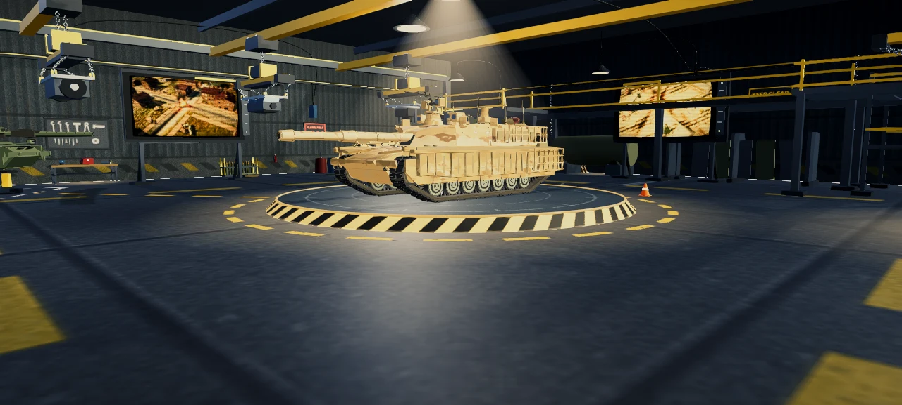
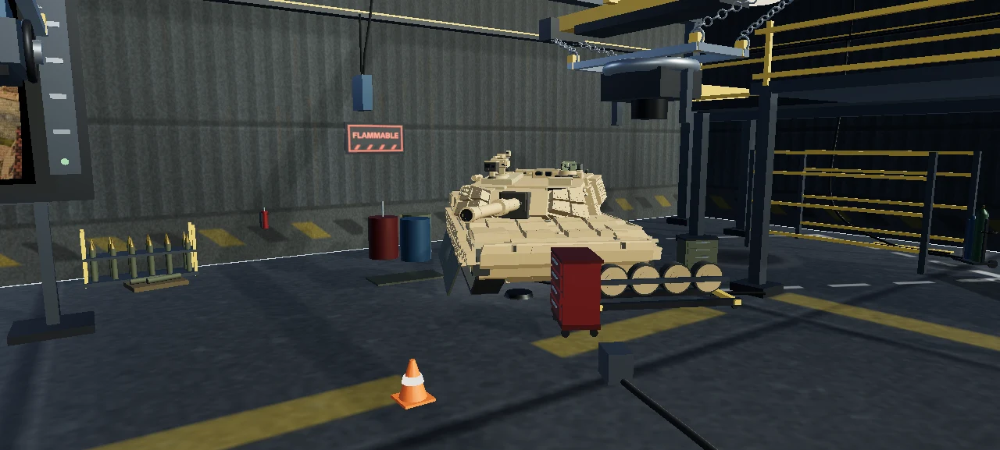
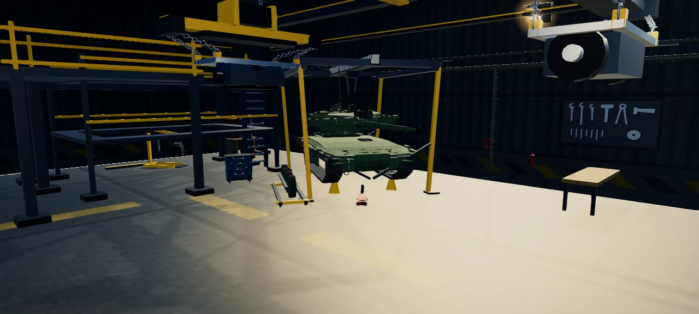

# Garage environments

Claude of Tanks has ten selectable Garage locations. They are presentation
spaces, not hidden copies of the battlefields: Verdant Motor Pool retains its
authored indoor workshop, while the other nine locations use compact,
renderer-only scene packs that borrow the terrain, structures, vegetation,
materials, sky, and atmosphere of a specific battlefield.

[](../public/media/garage-environments-r2/verdant-workshop-floor.webp)

*Verdant Motor Pool workshop floor. The selected tank remains the visual anchor
while the working lights, rails, cranes, screens, service lanes, and occupied
side bays establish an active maintenance facility around it.*

| Abrams running-gear service | Burlak separated assembly |
| --- | --- |
| [](../public/media/garage-environments-r2/abrams-service-bay.webp) | [](../public/media/garage-environments-r2/burlak-service-bay.webp) |

*The side bays use complete procedural fleet geometry as believable service
exhibits: running gear can be removed onto dollies, hull and turret work remains
physically supported, and lift coverage aligns with the work area.*

[](../public/media/showcase-r2/process/review-01.webp)

*Production contact sheet, 4 September 2026. Every panel is an in-engine
Garage capture using the same selected vehicle and interface, which makes
environment, structure, lighting, platform, and framing differences directly
comparable.*

## Location roster

| Garage | Battlefield identity | Architecture | Approach and service character |
| --- | --- | --- | --- |
| Verdant Motor Pool | Verdant Fields | Enclosed field shed | Restored indoor workshop with four service stations |
| Sirocco Deployment | Sirocco Wadi | Shade depot | Compacted convoy route, adobe court, palms, and acacia |
| Frosthollow Deployment | Frosthollow | Repair bunker | Ploughed recovery road, alpine buildings, spruce, and birch |
| Steinburg Deployment | Steinburg | Brick arsenal | Cobbled arsenal boulevard, factory frontage, and urban skyline |
| Saltmere Deployment | Saltmere Bay | Naval drydock | Hardstand, drydock rails, harbor structures, and coastal horizon |
| Cinder Deployment | Cinder Junction | Rail roundhouse | Three service roads, rail fan, platforms, canopies, and roundhouse |
| Monsoon Deployment | Monsoon Ridge | Rain canopy | Raised service terrace, drainage causeway, and dense green planting |
| Glacier Deployment | Glacier Pass | Rock cavern | Alpine pass, cold service shelters, chapel, and mountain horizon |
| Redrock Deployment | Redrock Divide | Recovery yard | Heavy-lift frame, recovery trail, compound, and mesa layers |
| Ironworks Deployment | Ironworks | Factory line | Foundry haul road, stacks, pipes, offices, and industrial skyline |

The registry and player-visible metadata live in
[`src/game/garageVariants.ts`](../src/game/garageVariants.ts). Environment
recipes live in
[`src/ui/garageEnvironmentRecipes.ts`](../src/ui/garageEnvironmentRecipes.ts);
they name the real structure builders,
terrain surface, source-map beat, tree species, horizon grammar, approach, and
distinctive scene layers for each destination.

## Visual contract

All ten locations share one presentation coordinate system:

- the hero tank keeps the same heading, front three-quarter pose, look height,
  camera offset, and field of view;
- the bow and gun read toward screen-left while the glacis remains visible;
- buildings and maintenance frames align with the tank axis instead of turning
  independently toward the camera;
- perimeter structures remain axis-parallel, with the working facade reversed
  only across the foreground row so doors and open bays face into the yard;
- the ground and sampled terrain remain below the complete turntable, so no
  biome can cover the platform rim;
- the rear-axis field-record display and four full-detail service exhibits are
  recomposed around the destination without becoming tank-shaped proxies.
- Verdant's three overhead lift stations keep their compact loads above the
  work floor, with the center trolley parked beside the hero silhouette; all
  twelve slings terminate on visible frame-mounted eyes.

[`src/game/garagePresentationPose.ts`](../src/game/garagePresentationPose.ts)
owns these invariants. Environment code
may change scenery and atmosphere, but it cannot introduce a second camera or
vehicle-orientation path.

Each outdoor scene pack contains a generated 41x37 excerpt of its source
battlefield terrain, nine or ten connected map structures across at least four
perimeter sectors, a continuous terrain-graded approach made from closed
surface ribbons rather than tilted rigid slabs, detailed trees,
bounded ground cover, two complete maintenance stations, operating machinery,
heavy-lift equipment, grounded freestanding service signs, and five
biome-specific horizon layers. Shared
procedural sky, cloud, fog, and sun presets reproduce the source map without
mounting its battlefield runtime.

## Runtime and resource ownership

Garage boot prioritizes the selected vehicle, platform, essential interface,
and first useful frame. The optional environment and workshop layers then
arrive through idle, cancellable work:

1. Selector intent prepares only the requested environment.
2. The previous complete scene remains visible until the new pack is ready.
3. The environment cache retains at most the active and previous scene graphs.
4. A dedicated worker builds the Burlak, Abrams, T-90M, and K2 service exhibits
   from the real procedural fleet geometry.
5. Stable scenery is merged or instanced; Garage-only textures and geometry
   leave GPU residency before battle.
6. Once the Garage settles, presentation becomes event-invalidated and sleeps
   until input, a streamed chunk, resize, context recovery, or phase change.

The Garage never constructs battlefield collision, destructible services,
animated vegetation, or a world update loop. See [SYSTEMS.md](SYSTEMS.md) for
lifecycle ownership and [PERFORMANCE.md](PERFORMANCE.md) for boot and
frame-budget policy.

## Structure, collision, and quality gates

The Garage quality gate treats visual defects as release failures rather than
averaging them away. Every location must score at least 90/100 and have no
failed criterion. The rubric checks:

- connected walls, roofs, braces, cranes, fixtures, and ground contacts;
- geometry-derived collision envelopes for every structure, including open
  compounds that preserve intentional drive-through space;
- no scenery overlap, floating parts, platform intersections, route grades
  above ten percent, or opening-view obstruction;
- readable maintenance purpose, four real fleet exhibits, and a full 360-degree
  service story;
- map-specific terrain, vegetation, structures, materials, skyline, and route;
- no more than 50,000 triangles and 25 draw calls per outdoor environment;
- normal-speed environment switches below the 80 ms maximum-frame-gap gate;
- bounded texture residency, two-pack caching, and no retained heap growth after
  repeated complete cycles.

The browser probe captures the default, left, rear, and right views of every
location plus tablet and phone layouts. It also tests selector races, rapid
switching, persisted selection, cold reload, workshop streaming, and resource
growth.

```sh
npm run typecheck
node src/game/garageVariants.selftest.mjs
node src/game/garagePresentationPose.selftest.mjs
node src/ui/garageArchitecture.selftest.mjs
node src/ui/garageQualityRubric.selftest.mjs
node tools/garage-variants-probe.selftest.mjs
npm run qa:structures
npm run qa:tree-trunks
npm run qa:garage -- --url=http://127.0.0.1:4178 --orbit-shots=1
npm run perf:garage-entry -- --url=http://127.0.0.1:4178
```

Machine-generated screenshots and performance traces remain local QA evidence.
This document and the owner-approved contact sheet are the maintained public
description of the system.
