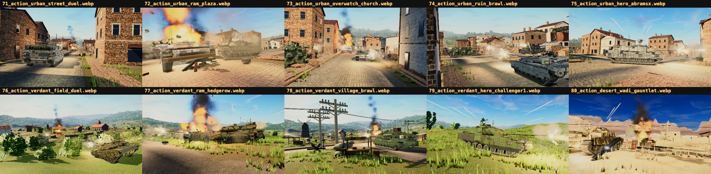

# Marketing battle campaign

The R3 campaign is a deterministic set of 60 in-engine 4K battle images:

- `tools/marketing-shots/scenes-action-r3/`: 30 close multi-tank action scenes,
  numbered 61-90.
- `tools/marketing-shots/scenes-foreground-r3/`: 30 foreground-led variants,
  numbered 91-120.

Every image is rendered by Scene Studio with current first-party
procedural tanks and materials. Source/comparison models and generated-image
substitutes are not part of this path. PNG exports under `shots/` are local
artifacts; the scene definitions and generation/grade tools are the durable
sources.

## Composition contract

`npm run shots:battle:generate` rebuilds both scene directories from 30
previously scouted map/camera compositions and recasts them with the current
modern fleet. The generator refuses a campaign unless all of these are true:

- exactly 30 action scenes and 30 foreground scenes;
- at least four tanks, two firing effects, and one major explosion per scene;
- action camera within 29 m of a tank;
- foreground camera 7-14 m from its anchor tank;
- lens between 30 and 52 degrees;
- unique source composition for every action/foreground pair.

The action contact sheet must visibly show multiple readable tanks in every
frame. The foreground sheet must show a large, readable anchor tank plus battle
depth. Actor counts alone do not establish acceptable composition. Reject frames with
camera/scenery intersections, dominant walls or foliage, clipped silhouettes,
or effects that erase the vehicle shape.

## Capture and review

Generate low-cost review frames and contact sheets first:

    npm run shots:battle:generate
    node tools/marketing-shots/shoot.mjs \
      --scenes tools/marketing-shots/scenes-action-r3 \
      --out shots/marketing-battles-r3/action-review --width 1600
    node tools/marketing-shots/shoot.mjs \
      --scenes tools/marketing-shots/scenes-foreground-r3 \
      --out shots/marketing-battles-r3/foreground-review --width 1600
    node tools/marketing-shots/contact.mjs --all \
      --dir shots/marketing-battles-r3/action-review \
      --out shots/marketing-battles-r3/action-review-sheets --tile 480 --cols 5
    node tools/marketing-shots/contact.mjs --all \
      --dir shots/marketing-battles-r3/foreground-review \
      --out shots/marketing-battles-r3/foreground-review-sheets --tile 480 --cols 5

After visual approval, export exact 3840x2160 PNGs:

    node tools/marketing-shots/shoot.mjs \
      --scenes tools/marketing-shots/scenes-action-r3 \
      --out shots/marketing-battles-r3/action-4k --width 3840
    node tools/marketing-shots/shoot.mjs \
      --scenes tools/marketing-shots/scenes-foreground-r3 \
      --out shots/marketing-battles-r3/foreground-4k --width 3840

Run the structural and exported-image gates:

    node tools/marketing-shots/battle-campaign.selftest.mjs
    npm run shots:battle:grade

The export grader requires exactly 30 PNGs in each output directory and checks
dimensions, minimum file density, mean exposure, dynamic range, black/white
clipping, saturation, and edge/detail density. Its JSON receipt defaults to
`shots/marketing-battles-r3/quality-report.json`. Contact-sheet inspection is
still mandatory because image statistics cannot prove tank visibility or a
good composition.

The publisher preserves that human-review evidence beside the final archive:

| Action review | Foreground review |
| --- | --- |
|  |  |

All six sheets and their exact frame ranges are indexed in
[`SHOWCASE-LIBRARY.md`](SHOWCASE-LIBRARY.md#review-sheets).
