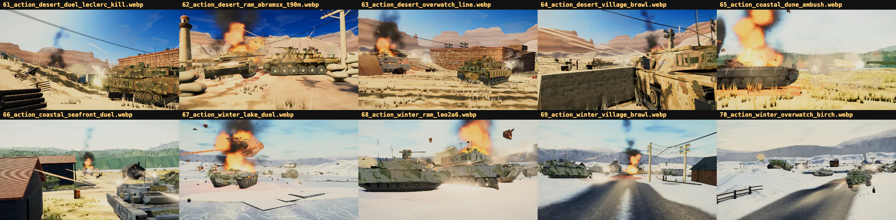
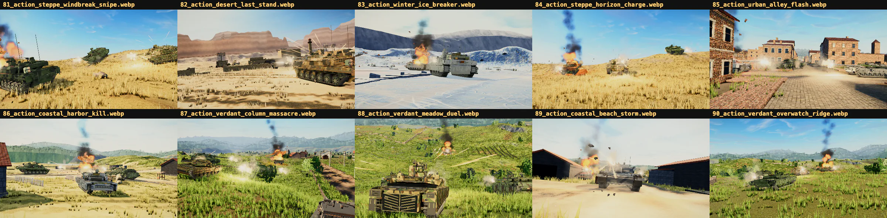
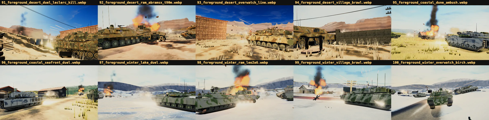
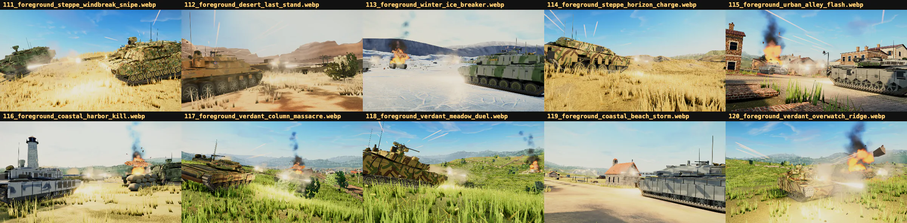

# Showcase library

`public/media/showcase-r1/manifest.json` is the published index of Claude of
Tanks screenshots. It contains the owner-selected feature set and the complete
approved campaign in a versioned, searchable library.

## R1 contents

| Collection | Frames | Role |
| --- | ---: | --- |
| Owner picks | 13 | The named feature shortlist used by the home page and loading rotation. |
| Action 4K campaign | 30 | Every approved multi-tank action composition. |
| Foreground 4K campaign | 30 | Every approved close, in-the-fight composition. |
| Studio action sequence | 5 | Keyframes from a directed, animated battle rendered in the game. |
| Interface | 10 | Garage, battle, gallery, killcam, mobile, and sight views. |
| **Total** | **88** | Public showcase frames. |

The campaign masters are 3840×2160 PNGs under `shots/marketing-battles-r3/`.
They remain gitignored because of their size. The checked-in site renditions
are 1920×1080 WebP files under `public/media/showcase-r1/`.

## Admission contract

A campaign image enters this library only when all of these are true:

1. A deterministic scene JSON exists in `tools/marketing-shots/scenes-action-r3/`
   or `tools/marketing-shots/scenes-foreground-r3/`.
2. The 4K master passes `shots:battle:grade` at the expected dimensions.
3. The owner approves the complete collection or names the frame explicitly.
4. The frame comes from the first-party runtime renderer—never a playable GLB
   or an unrelated external render.
5. The published manifest records actors, effects, seed, source scene, source
   master, and the quality receipt.

The 13 owner selections appear first and provide the shorter loading-screen
rotation. The full manifest contains all 88 published frames.

## Review sheets

The campaign is reviewed as a collection before individual 4K frames are
admitted. Each sheet places ten deterministic captures side by side with their
stable scene IDs. This makes camera intersections, weak tank silhouettes,
repetitive compositions, blown effects, and missing battle depth visible in a
single pass.

### Action campaign

| Frames 61–70 | Frames 71–80 | Frames 81–90 |
| --- | --- | --- |
| [](../public/media/showcase-r1/process/action-review-01.webp) | [](../public/media/showcase-r1/process/action-review-02.webp) | [](../public/media/showcase-r1/process/action-review-03.webp) |

### Foreground campaign

| Frames 91–100 | Frames 101–110 | Frames 111–120 |
| --- | --- | --- |
| [](../public/media/showcase-r1/process/foreground-review-01.webp) | [](../public/media/showcase-r1/process/foreground-review-02.webp) | [](../public/media/showcase-r1/process/foreground-review-03.webp) |

The published manifest records all six sheets, their frame IDs, and the review
sequence: scene JSON → review capture → contact-sheet inspection → 4K export →
automated grade → owner approval.

### Garage environment overview

[](../public/media/showcase-r2/process/review-01.webp)

This owner-approved contact sheet compares the ten current in-engine Garage
locations with ten non-Abrams vehicles and the current production interface.
It is maintained as system documentation rather than counted as an R1 campaign frame. See
[GARAGE-ENVIRONMENTS.md](GARAGE-ENVIRONMENTS.md) for the location roster and
acceptance contract.

### Landing fleet image

The home page's “Choose from 113 tanks” panel uses the owner-selected
1920×1080 production Garage capture at
`public/media/home/garage-m1a3-fleet.webp`. It shows the M1A3 Abrams with the
full battlefield, camouflage, dossier, nation, and vehicle-catalog interface.
The page serves an optimized WebP rendition of the supplied source frame.

## Rebuild

Generate and grade the campaign masters, render the Studio sequence, then
publish and verify the public library:

```sh
npm run shots:battle:generate
npm run shots:battle:grade -- --root shots/marketing-battles-r3
npm run studio:action:render
npm run showcase:publish
npm run showcase:check
```

Use `--campaign-root` and `--studio-root` with `showcase:publish` when the
approved masters live in another checkout. Publishing fails closed unless the
campaign quality report contains exactly 60 passing frames and no failures.
