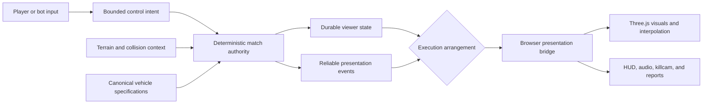
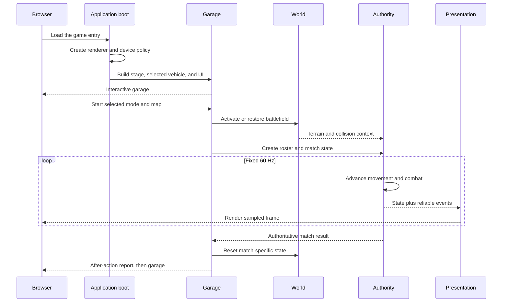
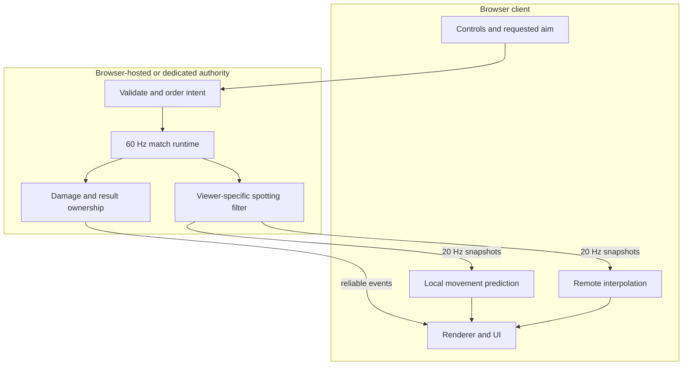

# Claude of Tanks technical overview

Status: current system reference

Audience: engineers, technical reviewers, tool authors, and contributors

Runtime: browser client, optional browser-hosted authority, and dedicated Node.js services

This document defines the current high-level architecture of Claude of Tanks.
It explains subsystem ownership, authority boundaries, data flow, runtime
lifecycle, and the invariants that changes must preserve. Detailed subsystem
behavior is delegated to the documents in [INDEX.md](INDEX.md).

The historical implementation plan in [ARCHITECTURE.md](ARCHITECTURE.md) is
retained as project evidence. It is not the current architecture reference.

## 1. System purpose and scope

Claude of Tanks is a browser-native armored combat game implemented directly
on Three.js. The application includes:

- deterministic tank movement and combat at a fixed 60 Hz simulation step;
- first-party procedural vehicle geometry and generated presentation assets;
- plate-level armor, physical projectiles, internal modules, crew, fire, and
  destruction;
- generated battlefields with terrain, collision, vegetation, destructibles,
  and concealment;
- in-page solo play, browser-hosted WebRTC rooms, and dedicated WebSocket
  authority;
- local prediction, remote interpolation, viewer-filtered snapshots, and
  reliable presentation events;
- desktop and mobile controls;
- a deterministic Scene Studio and a public Tank Gallery with geometry-focused
  markup tools;
- Node, browser, geometry, performance, asset, and build verification.

The architecture is organized around one rule: **presentation may visualize
authority, but it may not create authority**.

## 2. Architectural principles

### 2.1 Deterministic authority

Movement, aim, reload, ballistics, armor, damage, spotting, bots, timers, and
match outcome advance in fixed `1 / 60` second steps. Authoritative logic uses
seeded or injected randomness. It does not read wall-clock time or
`Math.random()`.

The renderer may run at any supported display rate. A faster display cannot
accelerate reloads, shell travel, repairs, fires, or vehicles.

### 2.2 Renderer-free rules

Modules under `src/sim/` and the transport-independent portions of `src/net/`
remain runnable in Node without a DOM or WebGL context. This permits the same
rules to run in the browser, in a browser-hosted room authority, or in the
dedicated service.

### 2.3 Explicit identity

The following identifiers are independent:

- player or peer identity;
- match entity identity;
- stable vehicle specification identity;
- presentation object identity.

Two players may select the same vehicle specification. They must still receive
separate entity states and separate visual rigs.

### 2.4 Hidden information is removed at authority

Spotting filters each viewer's snapshot before serialization. Hidden enemy
coordinates are not sent to a client and then concealed by rendering.

### 2.5 Durable state and one-shot events are separate

Hit points, module state, reload, visibility, destructibles, and result are
durable state. Shots, impacts, module alerts, destruction bursts, and match-end
presentation are reliable one-shot events. A persistent fact is never encoded
only as a transient event.

### 2.6 Quality policy is cosmetic

Device quality may change render scale, post-processing, shadows, vegetation,
texture budgets, particles, or background warmup. It may not change the combat
step, armor resolution, authoritative map dimensions, or game rules.

## 3. Top-level data flow



The `Delivery` boundary has three implementations:

1. Solo: direct in-page composition with no network transport.
2. Private or LAN: browser-hosted authority with WebRTC control/event and state
   channels.
3. Ranked: renderer-free dedicated authority with an ordered WebSocket
   service.

The authority rules remain the same. Only authority location and delivery
adapter change.

## 4. Source ownership

| Path | Owner | Public contract |
| --- | --- | --- |
| `src/sim/` | Deterministic gameplay rules | Node-runnable movement, combat, spotting, routing, and match authority |
| `src/net/` | Multiplayer protocol and delivery | Validated protocol, rooms, snapshots, prediction, reconciliation, and transport adapters |
| `src/vehicles/` | Fleet specification and presentation construction | Stable specs, procedural rigs, labels, ordering, materials, and asset fingerprints |
| `src/world/` | Battlefield composition | Maps, terrain, vegetation, props, collision, concealment, destructibles, and world manifests |
| `src/engine/` | Rendering platform | Renderer, camera, lighting, sky, post-processing, quality policy, warmup, and diagnosis |
| `src/game/` | Application orchestration | Local game state, input, bots, profile, killcam, garage dressing, and Scene Studio |
| `src/ui/` | Interactive presentation | Garage, HUD, rooms, settings, touch controls, reports, and presentation panels |
| `src/fx/` | Effects presentation | Pooled particles, impacts, decals, explosions, and a shared FX clock |
| `src/audio/` | Audio presentation | Spatial audio, engines, weapons, ambience, mix state, and voices |
| `server/` | Network services | Signaling, distributed rooms, dedicated matches, matchmaking, ratings, and HTTP surfaces |
| `tools/` | Reproducible proof | Generators, browser probes, performance tools, geometry gates, captures, and release checks |

`src/main.ts` is the strict TypeScript composition root. It should remain
surgical: subsystem policy belongs in the owner module, not in the boot file.

The shipped application graph has completed its strict-TypeScript migration.
Application, server, API, middleware, Vite configuration, and browser-tool
owners are `.ts`/`.tsx`, compile with `allowJs` disabled, and expose explicit
browser, rendering, UI, world, and gameplay contracts. Node command,
generator, and self-test entrypoints intentionally remain `.mjs`; they execute
the checked owners but are not an unchecked application tier. New behavior
must enter through a typed owner and focused parity test rather than a
JavaScript facade or compiler suppression.
Boot and transition screens now depend on strict shared DOM, font, icon,
image-preload, featured-media, map-art, and tier-metadata contracts rather than
crossing back into unchecked presentation helpers.
Boot-time GPU diagnostics and compatibility rescue are strict as well: tiny
offscreen probes validate lit, shadowed, and environment-backed rendering, and
the measured shadow/environment/fog ladder restores rejected stages without
leaking render targets or leaving unchecked global state.
Cascaded lighting and shadow scheduling are also strict: per-cascade snapped
fits, depth-target readiness, live quality resizing, covered priming, static
Garage dormancy, and conservative instanced-caster compaction are explicit
renderer contracts. Far-map transforms and their depth textures advance as one
scheduled unit, preventing stale-map flashes without reducing near-field motion.
The atmosphere owner is strict too: map presets, cloud-worker transfers,
horizon sampling, fog, shader injection, Canvas textures, and PMREM replacement
share one typed lifecycle. World activation carries that preset type directly
to the renderer instead of erasing it through the composition root.
The complete post-processing owner is strict TypeScript: scene resolve,
reconstruction, GTAO, aerial perspective, bloom, grading, late transparent FX,
and final anti-aliasing share explicit render-target, depth-texture, telemetry,
and quality-state contracts. Lazy combat FX is narrowed once when attached, so
the Garage render loop stays both demand-loaded and free of unchecked state.
Battle and Garage camera ownership is strict as well. Arcade, sniper, aim-ray,
cinematic, death, spectate, capture, recoil, collision, and showroom framing
states share one typed owner, while the composition root consumes that owner
directly instead of maintaining a partial duplicate interface.
Packaged tank portraits and battle-only top-down damage masks are strict too:
DOM fallbacks, lazy fleet builds, offscreen targets, pixel readback, Canvas2D
downsampling, layer metadata, and bounded cache states have one explicit owner.
The private-room operation surface is strict TypeScript end to end: mode and
map selection, signaling acquisition, ICE, named invites, lobby snapshots,
readiness, retained-room reattachment, and ranked queues cross explicit ports
before any session can hand off into battle. The loader, room coordinator, and
ranked client share those canonical contracts; incomplete match-room packets
cannot enter the complete lobby presentation surface.
Pure keyboard, flag, glyph, minimap, drive-readout, spectator, map-preview, and
Garage-order policy is also typed and remains directly Node-testable.
The browser input layer now exports strict action, binding, settings, gamepad,
touch-vector, and pointer-lock contracts; persisted JSON is narrowed before it
can affect a live control state.
The demand-loaded solo authority is strict TypeScript as well: inactive pooled
roster records and active simulation entities are separate types, while world,
collision, AI, shell, match-mode, event, and camera seams are explicit. This
keeps combat out of first-paint evaluation without leaving the fixed-step owner
unchecked.
The shared bot controller is strict TypeScript and renderer-free. Solo,
browser-hosted, and dedicated matches inject the same typed entity, terrain,
obstacle, spotting, and random-source ports, so target selection, routing,
articulated gun laying, friendly-fire discipline, and stuck recovery remain one
deterministic policy instead of drifting across authority modes.
Module/crew vocabulary, technical dossiers, hit formatting, shot-diagram
projection, and reconnect diagnostics now expose strict contracts to their
legacy renderers as the migration boundary advances inward.

## 5. Runtime lifecycle



### 5.1 Boot

The entry document paints the boot surface before the main module graph is
ready. Development-only Vite warmup and module preload flatten the static
`src/main.ts` import waterfall. Production uses bundled entries.

### 5.2 Garage

The garage constructs only presentation needed for selection and session
entry. The battlefield remains dormant. Verdant uses its restored authored
indoor workshop. One demand-loaded, optimized four-bay maintenance layer places
real first-party Burlak, Abrams, T-90M, and K2 displays around all ten Garage
types without duplicating the scene graph. Each of the other nine environments
is a bounded renderer-only scene pack built from a generated excerpt of its real battlefield terrain plus
connected structure kits, camera-composed instanced tree lines, static biome
ground cover, two-sided service facilities, two connected opening-view
maintenance frames, and three map-derived horizon
layers beneath the same procedural sky/cloud system as battle. A lightweight
registry applies each source map's exact atmosphere without loading that map.
Tank-shaped proxies are forbidden: the shared four-bay layer streams complete
fleet geometry and its actual turret, gun, armor, wheel, track, and rack parts
after interactive readiness. Since these are distant service exhibits rather
than selected vehicles, one dedicated worker supplies their full geometry to a
three-palette, solid national-service material adapter. It creates no texture
maps, omits unused colour/UV/tangent buffers, and never changes the playable or
pedestal material pipeline.
The active and previous packs are the only cached scene graphs, and Garage-only
textures and geometry leave GPU residency during battle. One immutable
Verdant-style presentation pose owns hero heading, camera offset, look height,
and FOV in every location. Optional network code and high-cost tooling remain
dynamically reachable. [GARAGE-ENVIRONMENTS.md](GARAGE-ENVIRONMENTS.md) records
the complete destination roster, owner-approved contact sheet, visual contract,
resource ownership, and release gates.

### 5.3 Battle activation

Battle entry activates the selected map, prepares the authority arrangement,
creates the roster, warms required visual programs, and transfers control from
the garage to the battle presentation.

### 5.4 Battle loop

Wall time enters a bounded accumulator. The application advances fixed steps
until caught up or until the configured safety bound is reached. The render
loop then samples current local or network state exactly once for visual
synchronization.

### 5.5 Result and reset

The authority determines the result. The presentation produces killcam and
after-action projections from resolved state and events. The after-action owner
is strict TypeScript: summary rows, adopted controls, animation handles, and
retained-room readiness cross explicit contracts. Returning to the garage
clears match-specific state while retaining safe immutable resources.

## 6. Vehicle model

A playable vehicle has four coordinated representations.

### 6.1 Specification

`src/vehicles/specs.ts` owns the registry. A specification includes:

- stable ID, display label metadata, nation, era, class, and tier;
- hit points, engine power, mass, speed limits, resistance, and traverse;
- gun articulation, reload, accuracy, aim behavior, and shell definitions;
- published dimensions;
- armor plates, internal modules, crew volumes, and rig pivots;
- procedural appearance metadata.

The display label is not derived ad hoc from the ID. UI and generated assets
consume `src/vehicles/tankLabels.ts`.

### 6.2 Authority state

Authority state records the match-specific entity: pose, velocity, controls,
aim, ammunition, reload, hit points, module and crew condition, spotting,
effects with gameplay consequences, and destruction.

### 6.3 Visual rig

`createTank(specId, engineCtx, options)` builds this hierarchy:

```text
tank_<specId>
├── rig_hull
└── rig_turret
    └── rig_gun
        └── rig_recoil
```

Family builders submit authored geometry into owner buckets. The factory
merges compatible geometry, applies materials and camouflage, constructs
running gear, installs fittings and state-driven presentation, and returns a
disposable visual interface.

All selectable runtime vehicles use first-party geometry. External models may
exist only as quarantined comparison or authoring inputs. Public builds remove
restricted comparison assets.

### 6.4 Generated asset record

The asset pipeline renders hero, side, top, silhouette, armor, module, crew,
and marking views from the live rig. A manifest binds these outputs
to metadata and geometry fingerprints. A fleet or geometry change therefore
makes stale presentation assets detectable.

## 7. Combat resolution

### 7.1 Movement

`src/sim/movement.ts` consumes normalized controls, vehicle parameters,
terrain support, collision context, and the fixed time step. It returns
authoritative pose, velocity, hull attitude, support state, and track travel.

Presentation uses support and travel for wheels, tracks, and suspension. It
does not feed cosmetic placement back into authority. The closed mechanical
vocabularies in `src/vehicles/wheelPatterns.ts`,
`src/vehicles/trackPatterns.ts`, and `src/vehicles/suspensionPatterns.ts`
resolve one deterministic complete running-gear family per vehicle.

### 7.2 Aiming and firing

1. Input selects a finite world-space aim point.
2. Authority converts the point into bounded local yaw, pitch, and distance.
3. Turret and gun approach the legal solution at specification-defined rates.
4. Authority resolves the actual muzzle transform.
5. Dispersion is applied.
6. A physical shell begins travel from the resolved muzzle.

A client cannot submit a hit, damage value, or authoritative muzzle transform.

### 7.3 Armor and damage

`src/sim/ballistics.ts` advances the shell and finds an impact candidate.
`src/sim/armor.ts` evaluates the struck plate, including slope, impact angle,
normalization, ricochet, overmatch, spaced layers, composites, ERA, and
kinetic/chemical protection. `src/sim/damage.ts` applies vehicle, module, crew,
fire, and destruction state.

Killcam data is emitted by this resolution. The killcam never performs a
second armor calculation.

### 7.4 Spotting

`src/sim/spotting.ts` evaluates range, concealment, movement and firing state,
foliage, line of sight, and radio relationships. Network authority then
creates a viewer-specific snapshot with hidden transforms removed.

## 8. Multiplayer architecture



### 8.1 Protocol

`src/net/protocol.ts` defines strict versioned envelopes and validation. Protocol
parsing rejects invalid types, bounds, identifiers, and sequencing before
those values enter match policy.

### 8.2 State delivery

Snapshots are published at 20 Hz while authority continues at 60 Hz. WebRTC
uses a replaceable unordered state channel and an ordered reliable control and
event channel. Ordered WebSocket delivery coalesces obsolete pending state so
old snapshots do not block current control traffic.

Snapshot codecs use per-peer baselines, deltas, acknowledgements, and periodic
keyframes. A client missing a required baseline waits for a keyframe.

### 8.3 Prediction and reconciliation

The local client predicts the shared movement integrator with terrain and
collision context. Authority snapshots reconcile error without granting the
client authority. Remote vehicles use adaptive interpolation, shortest-angle
rotation blending, and bounded extrapolation.

### 8.4 Rooms and services

Private and LAN rooms retain roster, team, spectator, readiness, and rematch
state around an active match. Signaling coordinates peers but does not become
combat authority. Ranked services own dedicated match creation, rating, and
matchmaking.

See [MULTIPLAYER-ARCHITECTURE.md](MULTIPLAYER-ARCHITECTURE.md) for the complete
protocol and service contract.

## 9. Presentation and performance

`src/net/browserBattleBridge.ts` applies sampled authority state to the
browser model. The main render loop owns final tank synchronization. The
presentation event queue applies critical transitions immediately and admits
heavy cosmetic effects within a bounded frame budget.

Performance policy covers:

- staged route and phase loading;
- development module warmup without changing production output;
- adaptive render scale and optional post-processing;
- quality-scaled shadow, vegetation, texture, and particle budgets;
- shader and resource warmup outside live control windows;
- reusable scratch state in established hot loops;
- explicit visual and render-target disposal;
- GPU black-frame and device diagnosis paths;
- reproducible performance traces and cold-load probes.

The renderer restores previous render targets in guarded cleanup paths. A
failed optional pass must not strand later frames on an off-screen target.

See [PERFORMANCE.md](PERFORMANCE.md) for the current performance architecture.

## 10. Product and authoring tools

### 10.1 Tank Gallery

`/gallery` is the public vehicle reference and geometry-review workbench. It
loads one live procedural rig, provides orbit and repeatable preset cameras,
exposes hull, turret, and gun articulation, and renders selectable armor,
module, and crew diagnostics from canonical spec volumes. Its Markup layer
selects exact triangles or coplanar patches and exports mesh identity,
articulation ownership, local/world bounds, camera pose, requested operation,
and matching PNG evidence. Copyable fleet data uses the versioned
`claude-of-tanks/gallery-spec@1` schema; surface review packets use
`tank-gallery-surface-markup` schema version 1.

See [GALLERY.md](GALLERY.md).

### 10.2 Scene Studio

`/studio` stages real maps, vehicles, damage states, effects, and cameras with
combat paused. Its scene JSON is round-trippable. Seeded effects can advance to
an exact shared FX time and freeze for deterministic capture.

See [STUDIO.md](STUDIO.md).

## 11. Verification model

Verification is selected by the surface that can fail.

| Layer | Tools | Establishes |
| --- | --- | --- |
| Deterministic module | Node `*.selftest.mjs` | Math, policy, schema, state transitions, codecs, and ownership invariants |
| Browser integration | Chromium/Puppeteer probes | DOM flow, transport, renderer, timing, and user-facing behavior |
| Vehicle geometry | Geometry gates, shaded critics, fingerprints | Shape, articulation, provenance, generated asset freshness, and appearance |
| Performance | Cold-load, development trace, frame probes | Boot cost, frame ownership, stalls, quality rescue, and regressions |
| Artifact | Public and private Vite builds | Route reachability, bundling, and quarantine stripping |

Minimum aggregate verification:

```bash
npm run typecheck
npm test
npm run test:net:browser
npm run tank:native:check
npm run tank:assets:check
npm run build
npm run build:private
```

Run the narrowest relevant self-test before aggregate verification. Browser
and visual changes also require rendered interaction evidence.
The authoritative ordered suite inventory is `tools/selftest-suites.mjs`.

## 12. Change checklist

Before merging an architecture-relevant change:

1. Identify the subsystem that owns the decision.
2. Preserve the fixed-step, renderer-free, identity, hidden-information, and
   authority invariants.
3. Add or update a focused self-test at the smallest honest layer.
4. Update the nearest current subsystem document.
5. Update `README.md`, `FEATURES.md`, `docs.html`, or generated assets when the
   public product changed.
6. Run focused verification, `npm test`, and the appropriate browser or build
   proof.
7. Refresh Agent-Docs generated facts with `npm run agent-docs -- scaffold .`
   and run the docs doctor.

## 13. Documentation authority

If current documents disagree:

- this document owns the high-level architecture;
- [SYSTEMS.md](SYSTEMS.md) owns detailed runtime subsystem behavior;
- [MULTIPLAYER-ARCHITECTURE.md](MULTIPLAYER-ARCHITECTURE.md) owns networking;
- [PERFORMANCE.md](PERFORMANCE.md) owns performance policy;
- [BUILD-STANDARD.md](BUILD-STANDARD.md) and
  [GEOMETRY-GATE.md](GEOMETRY-GATE.md) own vehicle-authoring acceptance;
- executable code and tests define shipped behavior.

Use [INDEX.md](INDEX.md) as the complete documentation router.
